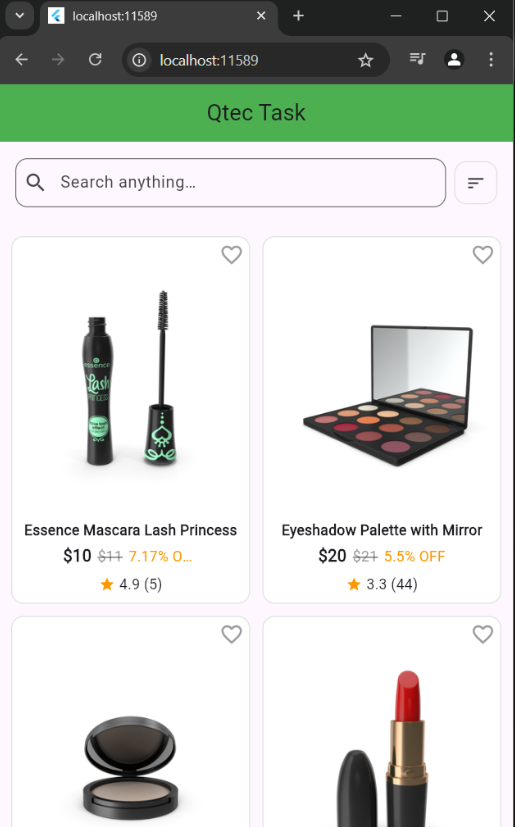
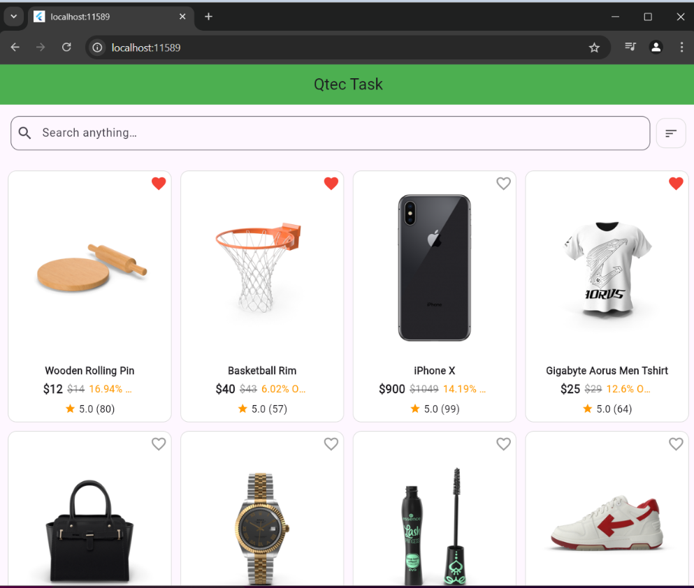
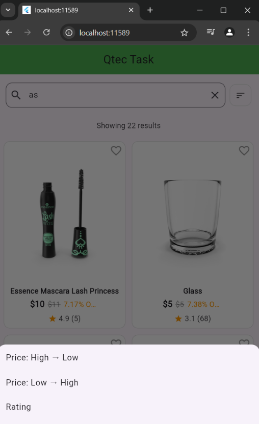
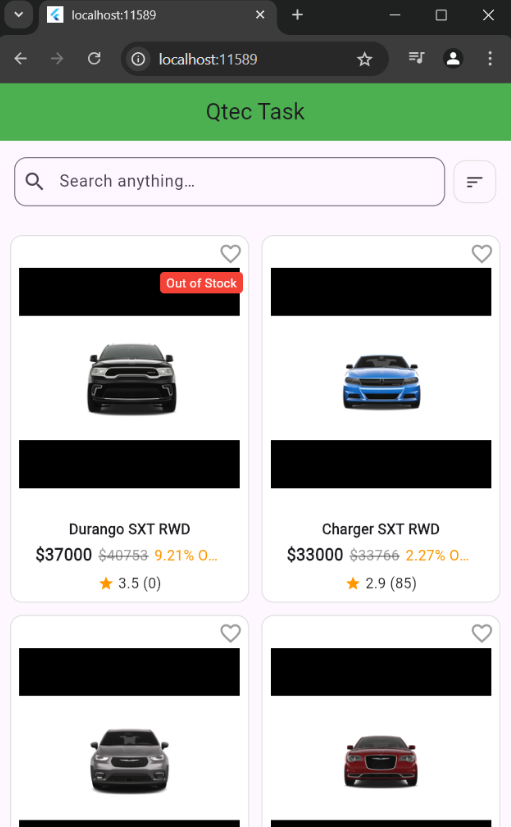
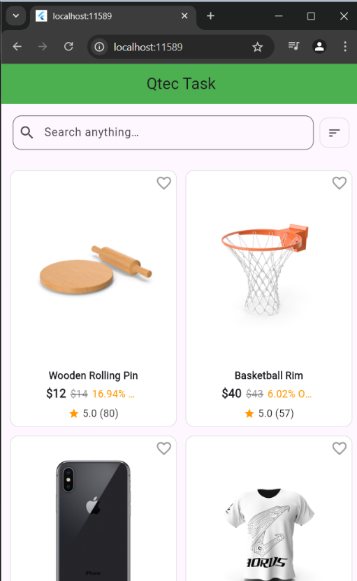
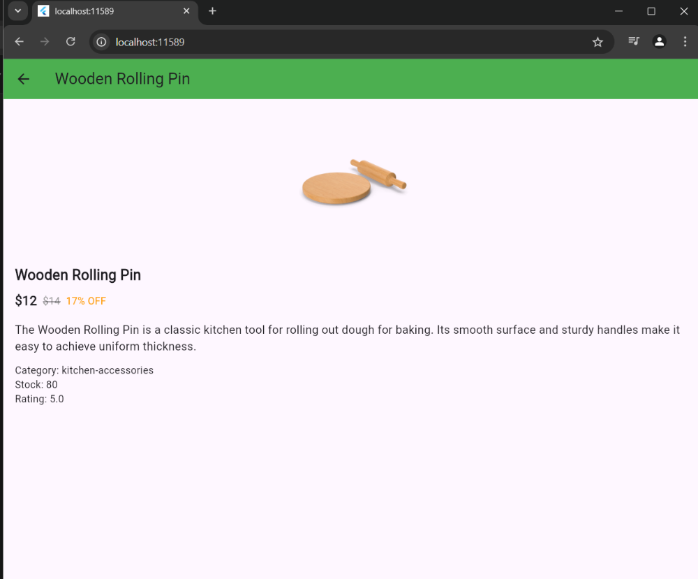

# 🛍️ QTech Task For Flutter shopping app

A modern Flutter shopping app that displays products using the [DummyJSON API](https://dummyjson.com/products). Built with **Riverpod 2.0** for state management, **Hive** for offline caching, and clean architecture for scalability.

## 📱 Features

- ⚡ Smooth infinite scroll product list
- 🔍 Search filtering with instant updates
- 🔄 Sort by price, rating, and title
- 🧊 Shimmer loading effects
- ✅ "Out of Stock" labels
- 📦 Product detail screen with full info
- 📥 Offline cache using Hive
- 🌐 Web, Android, and iOS support

---

## 📦 Tech Stack

| Tool           | Description                                  |
|----------------|----------------------------------------------|
| Flutter        | UI framework                                 |
| Riverpod 2.0   | State management                             |
| Hive           | Local storage for caching products           |
| HTTP           | For calling DummyJSON API                    |
| Path Provider  | To store Hive boxes (non-web platforms)      |

---

## 📸 Screenshots
### 🏠 Homepage

- This is the responsive homepage

### 🔍 Search and Sort
- - Search filtering with instant updates When user type something in search bar like 'm' it's show all the product contains 'm'

- When user tapped the manu icon it's Show sort Option

- When user select High to Low

- When user select Rateing

### 📄 Product Detail
- When user tapped a spacific product card then it's show the full product Details

